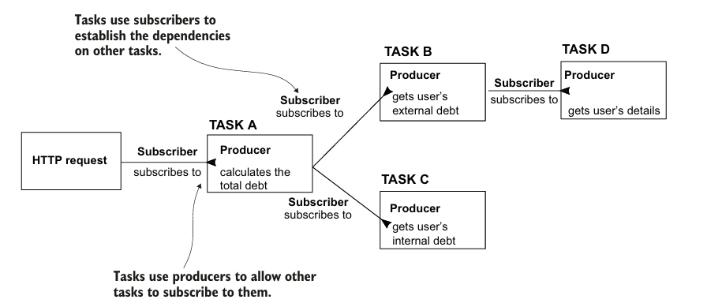

# Capítulo 11

* Consumindo APIs REST
* Spring Cloud OpenFeign
* RestTemplate
* Webclient

## Consumindo APIs
No mundo real, sistemas raramente funcionam de forma isolada. Eles trocam dados o tempo todo: um serviço de e-commerce pode consultar uma API dos Correios para calcular o frete, ou acionar um sistema de pagamentos para finalizar uma compra.

Até aqui, focamos no papel de quem expõe uma API — recebendo, interpretando e respondendo requisições HTTP que representam intenções de uso sobre os dados do sistema. Neste capítulo, vamos olhar para o outro lado da comunicação: o de quem consome uma API.

## Chamadas Bloqueantes vs Não-Bloqueantes
Antes de partir para o uso e particularidades de cada ferramenta, é importante entender dois modelos de execução: bloqueante (síncrono) e não-bloqueante (assíncrono). A escolha entre esses dois modelos tem impacto direto na perfomance da aplicação, pois define como o sistema lida com a comunicação com serviços externos e recursos de entrada e saída.

### Modelo Bloqueante
No modelo bloqueante, cada unidade de trabalho — como uma requisição HTTP ou uma consulta ao banco de dados — é executada de forma sequencial por uma única thread. A thread responsável inicia a operação e permanece inativa (bloqueada) até que a resposta seja recebida e o processamento possa continuar. Esse comportamento implica em um acoplamento direto entre o tempo de espera de cada operação e a disponibilidade de threads.

Com o aumento do volume de requisições simultâneas, o servidor precisa de mais threads para manter o desempenho — o que eleva o consumo de memória e desempenho, afetando negativamente a  escalabilidade.

### Modelo Não-Bloqueante
Por outro lado, no modelo não-bloqueante, o processamento é reorganizado em unidades menores e desacopladas, tratadas como eventos assíncronos. Em vez de associar uma thread exclusiva a cada requisição, o sistema utiliza um pool de threads para gerenciar múltiplas tarefas de forma concorrente e eficiente.

Quando uma operação de I/O (como acesso a disco ou rede) é iniciada, a thread que a disparou não fica ociosa aguardando o resultado. Em vez disso, um callback — uma função registrada para ser executada assim que a operação for concluída — é associado à tarefa. Dessa forma, a thread é imediatamente liberada para lidar com outras atividades enquanto o sistema aguarda a resposta da operação de forma assíncrona.

## Spring Cloud OpenFeign
O **OpenFeign** é um cliente HTTP declarativo. Isso significa que saímos de um modelo imperativo — onde dizemos **como** a chamada HTTP deve acontecer (montando a URL, configurando headers, serializando/desserializando) — para um modelo declarativo, no qual apenas **expressamos a intenção da chamada**, e o framework cuida do resto em tempo de execução.

Com o OpenFeign, espelhamos os métodos de um endpoint REST de outro serviço a partir de uma interface Java, utilizando a sintaxe familiar das anotações do Spring MVC (```@GetMapping```, ```@PostMapping```, etc.), que definem a URL, o método HTTP, os parâmetros, headers, entre outros. Tais interfaces são chamadas de **Feign Clients**.

### Habilitando o Feign
Antes de tudo, é preciso informar ao Spring que ele deve escanear e gerenciar essas interfaces. Isso é feito adicionando a anotação ```@EnableFeignClients``` em uma classe de configuração principal:

```java
@SpringBootApplication
@EnableFeignClients(basePackages = "com.example.base")
public class Application {
    public static void main(String[] args) {
        SpringApplication.run(Application.class, args);
    }
}

```
### Definindo o cliente de pagamento
Vamos ver um exemplo de cliente para integração com um serviço de pagamentos externo:

```java
@FeignClient(name = "payment", url = "${api.payment.url}")
public interface PaymentClient {

    @PostMapping("/transactions")
    PaymentResponse processPayment(@RequestBody PaymentRequest request);

    // outros métodos...
}
```

### Consumindo com Feign na prática
Após declarar a interface, podemos injetá-la em nossos serviços normalmente, como qualquer outro bean gerenciado pelo Spring:

```java
@Service
public class CheckoutService {

    private final PaymentClient paymentClient;

    public CheckoutService(PaymentClient paymentClient) {
        this.paymentClient = paymentClient;
    }

    public PaymentResponse checkout(Cart cart) {
        PaymentRequest request = new PaymentRequest(
            cart.getTotalAmount(),
            cart.getCustomer().getCardToken()
        );

        PaymentResponse response = paymentClient.processPayment(request);

        if (!response.isSuccess()) {
            throw new PaymentFailedException("Pagamento recusado: " + response.getReason());
        }

        return response;
    }
}
```
Nesse exemplo, o ```CheckoutService``` envia os dados do carrinho para a API de pagamentos. A chamada HTTP é feita como se estivéssemos apenas invocando um método Java.

Isso é possível graças ao uso de proxies dinâmicos — um conceito discutido no capítulo 6 sobre **AOP** (Programação Orientada a Aspectos)**. Embora o OpenFeign utilize um mecanismo semelhante, ele não depende diretamente do Spring AOP, e sim de sua própria infraestrutura.

Além disso, o OpenFeign opera sob um modelo bloqueante de execução. Ao realizar chamadas HTTP, ele utiliza internamente a infraestrutura síncrona do Spring MVC, o que significa que cada requisição externa bloqueia a thread até a conclusão da resposta.
Apesar disso, sua expressividade e baixo acoplamento o tornam uma excelente escolha, autor destaca a praticidade dessa abordagem e recomenda seu para apliocações modernas e não-reativas. 

## Rest Template

O RestTemplate é um componente do módulo Spring Web que fornece uma API imperativa para interagir com serviços RESTful. Diferente do OpenFeign, o RestTemplate exige a construção manual das requisições HTTP — especificando a URL, o método HTTP, os parâmetros, os headers e o tipo de retorno esperado.

Essa abordagem foi, por muitos anos, a principal forma de consumir APIs no ecossistema Spring. Embora ainda seja funcional e amplamente utilizada em projetos legados, o RestTemplate está atualmente em modo de manutenção (deprecated) e vem sendo cada vez menos adotado em novos projetos. Isso não se deve a falhas na ferramenta, mas sim à evolução natural das necessidades nas aplicações modernas — que passaram a demandar funcionalidades que o RestTemplate não atende bem, como:

* Suporte a chamadas síncronas e assíncronas de forma flexível;

* Implementação nativa de retries, timeouts e fallbacks — lógicas de contingência que devem ser executadas automaticamente quando uma chamada HTTP falha.

* Redução de boilerplate (código repetitivo e mecânico);

### Usando o RestTemplate
Para consumir um serviço utilizando o RestTemplate, seguimos basicamente quatro etapas:

1. Registrar o RestTemplate como um bean no contexto do Spring, para que ele possa ser injetado em outros componentes.

2. Definir os cabeçalhos HTTP com uma instância de HttpHeaders, caso precise enviar informações adicionais (como um requestId ou Authorization).

3. Montar a requisição HTTP usando uma instância de HttpEntity, que encapsula os dados do corpo (payload) e os cabeçalhos.

4. Enviar a requisição com o método exchange(), que executa a chamada HTTP e retorna uma ResponseEntity.

### Definindo um bean RestTemplate
Definimos um bean ```RestTemplate``` em uma classe de configuração:

``` java
@SpringBootApplication
public class SpringStartsHere112Application {

	public static void main(String[] args) {SpringApplication.run(SpringStartsHere112Application.class, args);}

	@Bean
	public RestTemplate restTemplate() {
		return new RestTemplate();
	}
}
```

No caso ```@SpringBootApplication``` na classe principal implica ```@Configuration```, mas em projetos maiores pode ser uma boa prática extrair essa configuração para uma classe dedicada no pacote ```config```, como ```RestTemplateConfig```.

### Definindo um cliente com RestTemplate


```java
@Component
public class PaymentClient {

    private final RestTemplate rest;

    @Value("${api.payment.url}")
    private String paymentServiceUrl;

    public PaymentClient(RestTemplate rest) {
        this.rest = rest;
    }

    public PaymentResponse processPayment(PaymentRequest request) {
        String uri = paymentServiceUrl + "/transactions";

        HttpHeaders headers = new HttpHeaders();
        headers.add("requestId", UUID.randomUUID().toString());

        HttpEntity<PaymentRequest> entity = new HttpEntity<>(request, headers);

        ResponseEntity<PaymentResponse> response = rest.exchange(
            uri,
            HttpMethod.POST,
            entity,
            PaymentResponse.class
        );

        return response.getBody();
    }
}
```

Assim como o Feign, o RestTemplate também segue um modelo bloqueante, baseado em execução síncrona. Isso implica que cada chamada HTTP consome uma thread do servidor durante todo o tempo de espera pela resposta — o que pode impactar negativamente a escalabilidade em aplicações de alta concorrência. Ainda assim, o autor destaca o valor de conhecer a ferramenta, tendo em mente que boa parte das aplicações em produção atualmente fazem uso da mesma.

## WebClient
O **WebClient** é o cliente HTTP reativo do módulo **Spring WebFlux** — um componente projetado para lidar com fluxos de dados de forma assíncrona, não-bloqueante e com alta eficiência sob carga.

Em aplicações modernas, é comum a necessidade de consumir várias APIs externas simultaneamente — seja para consultar um sistema de pagamentos, buscar cotações ou integrar com serviços de entrega. Quando essas chamadas são realizadas de forma bloqueante, o tempo de espera de cada requisição consome uma thread do servidor, prejudicando a escalabilidade da aplicação.

O WebClient resolve esse problema ao adotar uma arquitetura baseada em programação reativa, onde o processamento é desacoplado em etapas assíncronas e orientadas a eventos. Essa abordagem permite que o sistema responda a milhares de requisições simultâneas com menos threads, aumentando o throughput e o desempenho sob alta concorrência.

### Programação Reativa
A programação reativa é fundamentada na especificação **Reactive Streams**, que define um contrato padronizado para comunicação assíncrona e não-bloqueante entre componentes. Seu objetivo é permitir o fluxo eficiente de dados, com suporte a backpressure — um mecanismo de controle que impede que produtores muito rápidos sobrecarreguem consumidores mais lentos.

O modelo segue o padrão *Publisher/Subscriber*, baseado em três papéis centrais:

* **Publisher**: emite elementos conforme eles se tornam disponíveis;

* **Subscriber**: consome esses elementos, podendo solicitar mais dados conforme sua capacidade de processamento;

* **Subscription**: representa o vínculo entre publisher e subscriber, controlando o fluxo de dados.

Esse padrão permite desacoplar a produção do consumo de dados, permitindo a composição de *pipelines* assíncronas — por exemplo, realizar uma requisição HTTP, processar a resposta e acionar outro serviço. Cada etapa do fluxo é executada apenas quando os dados estiverem prontos, sem bloquear nenhuma thread.

Examine esse exemplo:



Note que:

* Cada tarefa declara suas dependências por meio de Subscribers.

* O resultado de uma tarefa é exposto como um Publisher, permitindo que outras tarefas se inscrevam nele.

* Tarefas independentes (como TASK B e TASK C) podem ser iniciadas em paralelo, aproveitando recursos sem criar contenção.

* Tarefas que dependem de outras (como TASK B depende de D) aguardam de forma passiva, sem bloquear a thread, até que os dados estejam prontos.

Esse modelo substitui a ideia de "passos sequenciais" (em linha do tempo) por uma rede de dependências reativa, onde as tarefas são ativadas quando seus dados estiverem disponíveis.

### WebClient na prática

No WebFlux, ao fazer uma requisição com o WebClient, você não recebe diretamente os dados, mas sim um ```Mono<T>``` ou ```Flux<T>``` — um Publisher que emitirá o valor futuramente. Essa abstrações representam:

* ```Mono<T>```: **Publisher** de 0 ou 1 item;

* ```Flux<T>```: **Publisher** de 0 a N itens (um fluxo contínuo de dados).

Ambos implementam a interface ```Publisher<T>``` da especificação Reactive Streams.

Para realizar operações com os dados emitidos por esses publishers, registramos um *callback* que será executado assim que o dado estiver disponível — ao fazer isso, estamos declarando uma dependência entre duas tarefas assíncronas.

Podemos manipular esse Publisher com operadores reativos, como:

* ```map(...)```: transforma os dados;

* ```flatMap(...)```: encadeia publishers;

* ```filter(...)```: filtra dados emitidos;

* ```subscribe(...)```: consome diretamente (geralmente evitado em serviços).

### Definindo um bean WebClient 
Assim como fazemos com o ```RestTemplate```, é comum definir o WebClient como um bean em uma classe de configuração, para que o Spring possa gerenciar sua instância dentro do contexto da aplicação:

```java
@Configuration
public class WebClientConfig {

    @Bean
    public WebClient webClient() {
        return WebClient.builder().build();
    }
}
```

### Definindo um cliente com WebClient

```java
@Component
public class PaymentClient {

    private final WebClient webClient;

    @Value("${api.payment.base_url}")
    private String baseUrl;

    public PaymentClient(WebClient webClient) {
        this.webClient = webClient;
    }

    public Mono<PaymentResponse> process(PaymentRequest request) {
        return webClient.post()
            .uri(baseUrl + "/transactions")
            .bodyValue(request)
            .retrieve()
            .bodyToMono(PaymentResponse.class);
    }
}
```

Note que o método retorna um produtor ```Mono```, possibilitando que outra funcionalidade se inscreva ao resultado dessa etapa. Dessa forma o fluxo da aplicação é construido vinculando dependências entre tarefas a partir de produtores e consumidores.

### Consumindo com WebClient na prática

```java
@Service
public class CheckoutService {

    private final PaymentClient paymentClient;

    public CheckoutService(PaymentClient paymentClient) {
        this.paymentClient = client;
    }

    public Mono<PaymentResponse> checkout(Cart cart) {
        PaymentRequest request = new PaymentRequest(
            cart.getTotalAmount(),
            cart.getCustomer().getCardToken()
        );

        return paymentClient.processPayment(request)
            .flatMap(response -> {
                if (!response.isSuccess()) {
                    return Mono.error(new PaymentFailedException("Pagamento recusado: " + response.getReason()));)
                }

                return Mono.just(response);
            })
    }
}
```

Neste exemplo, utilizamos ```flatMap()``` porque estamos lidando com Monos (publishers), e não com valores já resolvidos. O encadeamento é feito de forma reativa: o próximo passo só será executado quando a resposta do pagamento estiver disponível.

## Conclusão

Embora o **WebClient** ofereça grandes benefícios em aplicações reativas, seu uso não é recomendado em arquiteturas tradicionais baseadas no Spring MVC, por conta da complexidade adicional, que pode acabar sendo desnecessária no fim das contas.

Para casos mais simples ou em aplicações não reativas, o uso do **OpenFeign** continua sendo uma excelente alternativa, devido à sua simplicidade e sintaxe familiar.
**
Além disso, o paradigma reativo e o uso do **WebFlux** foram apenas introduzidos de forma superficial, com foco nas diferenças entre os clientes HTTP disponíveis no Spring e suas particularidades na integração com APIs externas. O autor ressalta a necessidade de um entendimento profundo da abordagem reativa antes de implementá-la realisticamente.

Por fim, apesar de o **RestTemplate** estar atualmente em modo de manutenção (deprecated), ele ainda está presente em muitos projetos legados. Por isso, é fundamental compreender seu funcionamento básico para garantir a manutenção e a migração consciente de sistemas existentes.