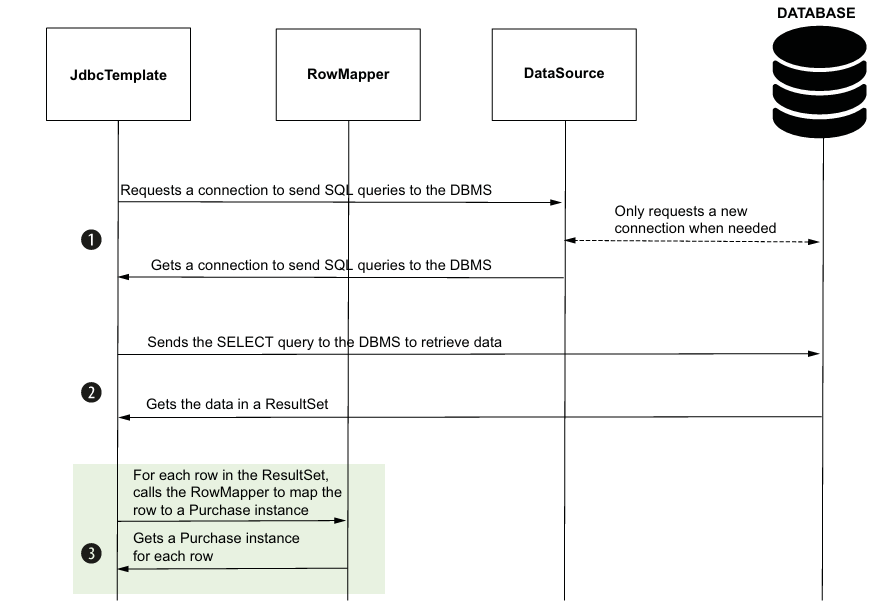

# Capítulo 12

* Fontes de Dados

* JdbcTemplate

* Customizando fontes de dados

## Fontes de Dados

Uma fonte de dados (DataSource) é o componente responsável por gerenciar conexões com o banco de dados, abrindo e fechando conexões somente quando necessário para otimizar performance. A JDK oferece abstrações essenciais para trabalhar com bancos relacionais, como ```Connection```, ```Statement``` e ```ResultSet```. Porém, para conectar-se a um banco específico — como MySQL, PostgreSQL, Oracle — precisamos de um driver JDBC fornecido por cada fornecedor de SGBD. Esse driver implementa as interfaces do JDBC e permite a comunicação com o banco.

Uma forma simples, mas pouco eficiente, de se conectar a um banco é usando diretamente o driver JDBC via ```DriverManager.getConnection()```, passando URL, usuário e senha para cada operação. Isso gera overhead porque a conexão é aberta e fechada toda vez, o que não é ideal para aplicações reais.

Para resolver isso, utilizamos a fonte de dados, que encapsula o gerenciamento de conexões, reutilizando-as e controlando seu ciclo de vida para melhorar a eficiência da aplicação.

No ecossistema Spring, a implementação padrão de fonte de dados é o HikariCP — um connection pool moderno e performático, adotado por convenção no Spring Boot.

## JdbcTemplate
Mesmo com uma fonte de dados eficiente, trabalhar diretamente com as classes JDBC da JDK pode ser verboso e propenso a erros, mesmo para operações simples.

O **JdbcTemplate** é uma ferramenta fornecida pelo Spring que simplifica o acesso a dados relacionais, abstraindo o boilerplate da API JDBC. É uma ótima escolha para projetos pequenos ou para quem está aprendendo a camada de persistência no Spring, já que evita a dependência de frameworks mais complexos como JPA/Hibernate.

No desenvolvimento com Spring, é comum organizar o acesso a dados em classes chamadas repositories, que encapsulam as operações de persistência.

## Exemplo Prático

No diretório resources do projeto, criamos um arquivo schema.sql contendo as queries para criar as tabelas do banco. O Spring executa automaticamente esse script na inicialização da aplicação. Exemplo:

```SQL
CREATE IF NOT EXISTS purchase (
    id INT AUTO_INCREMENT PRIMARY KEY,
    product VAR_CHAR(50) NOT NULL,
    price double NOT NULL
);
```

Para representar os dados da tabela na aplicação, criamos uma classe que mapeia uma linha da tabela:

```Java
public record Purchase(
        int id, 
        String name, 
        BigDecimal price
) {}
```

Aqui usamos **Records** (Java 21), que são classes compactas para representar dados imutáveis, evitando código boilerplate. Também usamos ```BigDecimal``` para valores monetários, pois tipos float e double podem causar perda de precisão em operações aritméticas.

### Implementando o repositório
Para usar o repositório com injeção de dependência, o tornamos um bean Spring usando a anotação ```@Repository```:


```java
@Repository
public class PurchaseRepository {

    private final JdbcTemplate jdbc;

    public PurchaseRepository(JdbcTemplate jdbc) {
        this.jdbc = jdbc;
    }

    public void storePurchase(Purchase purchase) {
        String sql = "INSERT INTO purchase VALUES (NULL, ?, ?)";
        jdbc.update(sql, purchase.name(), purchase.price());
    }

    //...
}
```

O Spring Boot detecta automaticamente a dependência do banco no pom.xml, configura o JdbcTemplate e a fonte de dados (HikariCP) para nós. Caso não usemos Spring Boot, precisaríamos configurar esses beans manualmente:

```java
  @Configuration
public class AppConfig {

    @Bean
    public DataSource dataSource() {
        return new DriverManagerDataSource("jdbc:h2:mem:testdb", "sa", "");
    }

    @Bean
    public JdbcTemplate jdbcTemplate(DataSource dataSource) {
        return new JdbcTemplate(dataSource);
    }
}
```

### Consultas com JdbcTemplate
Com JdbcTemplate, usamos o método update() passando o SQL e os parâmetros para executar as queries de forma simples e prática.

```java
public void storePurchase(Purchase purchase) {
        String sql = "INSERT INTO purchase VALUES (NULL, ?, ?)";

        jdbc.update(sql, purchase.name(), purchase.price());
    }
```

Com poucas linhas podemos adicionar, atualizar e remover registros em tabelas. Para consultas, usamos ```JdbcTemplate.query()``` com um SQL SELECT e um ```RowMapper``` — objeto que converte cada linha do ResultSet em um objeto ```Purchase```:



### Expondo dados via REST
Uma vez que podemos inserir e consultar dados do banco através do repositório, podemos expor essas funcionalidades por meio de endpoints REST, criando um controller:

```java
@RestController
@RequestMapping("/purchases")
public class PurchaseController {

    private final PurchaseService purchaseService;

    public PurchaseController(PurchaseService purchaseService) {
        this.purchaseService = purchaseService;
    }

    @GetMapping
    public ResponseEntity<List<Purchase>> listAllPurchases() {
        List<Purchase> purchases = purchaseService.findAll();
        return ResponseEntity.ok(purchases);
    }

    @PostMapping
    public void storePurchase(@RequestBody PurchaseRequest dto) {
        purchaseService.storePurchase(dto);
    }
}
```

## Customizando as configurações da fonte de dados
No exemplo anterior, usamos o H2 para testes. No entanto, em cenários reais, quase sempre será necessário conectar a um banco de dados externo — como PostgreSQL, MySQL ou Oracle. Vamos ver como personalizar essa configuração e manter tudo registrado como bean no contexto do Spring.

### Definindo fonte de dados por arquivo de propriedades
Para se conectar a um banco de dados real, os passos básicos são os seguintes:

1. Instalar e configurar um SGBD — como MySQL, PostgreSQL, Oracle, etc — e criar um banco de dados desejado.

2. Adicionar a dependência do driver JDBC correspondente. No exemplo abaixo, usamos o conector do MySQL, mas o mesmo se aplica a qualquer outro SGBD:

```java
<dependency>
	<groupId>com.mysql</groupId>
	<artifactId>mysql-connector-j</artifactId>
	<scope>runtime</scope>
</dependency>
```

3. Configurar a URL e as credenciais de acesso no ```application.properties```, para que o Spring Boot possa se conectar automaticamente ao banco de dados:

```properties
spring.datasource.url=jdbc:postgresql://localhost:5432/spring_starts_here_12
spring.datasource.username=<db_username>
spring.datasource.password=<db_password>
```

A partir dessas configurações, o Spring Boot detecta automaticamente o tipo de banco (com base na URL), inicializa o pool de conexões com o HikariCP (que é o default), registra a fonte de dados como bean no contexto da aplicação, e torna o ```JdbcTemplate``` funcional sem qualquer configuração adicional.

### Definindo fontes de dados como beans
Embora o Spring Boot configure automaticamente a fonte de dados com base nas propriedades informadas no application.properties, há cenários em que essa abordagem não é suficiente e precisamos definir a fonte de dados manualmente. Isso pode acontecer, por exemplo, quando:

* As credenciais (URL, usuário, senha) vêm de uma fonte externa ou de tempo de execução (runtime);

* A aplicação utiliza mais de uma fonte de dados, exigindo o uso de @Qualifier para diferenciá-las;
 
* Precisamos ajustar parâmetros de conexão, como tamanho do pool ou tempo limite;

* O projeto usa apenas Spring Framework, sem Spring Boot.

A definição manual é simples: criamos um método anotado com ```@Bean``` em uma classe de configuração (```@Configuration```) que retorna uma instância da fonte de dados que desejamos usar. Um exemplo com o HikariCP:

```java
@Configuration
public class ProjectConfig {

    @Value("${custom.datasource.url}")
    private String datasourceUrl;

    @Value("${custom.datasource.username}")
    private String datasourceUsername;

    @Value("${custom.datasource.password}")
    private String datasourcePassword;
    
    @Bean
    public DataSource datasourceX() {
        HikariDataSource dataSource = new HikariDataSource();

        dataSource.setJdbcUrl(datasourceUrl);
        dataSource.setUsername(datasourceUsername);
        dataSource.setPassword(datasourcePassword);
        dataSource.setMaximumPoolSize(10);
        dataSource.setConnectionTimeout(2_000);

        return dataSource;
    }
}
```

Note que usamos ```@Value``` para injetar os valores diretamente do arquivo de propriedades. Junto a isso, no ```application.properties```, definimos os valores customizados:


```properties
spring.application.name=spring_starts_here-12.1
custom.datasource.url=jdbc:postgresql://localhost:5432/<another_datasource>
custom.datasource.username=<db_username>
custom.datasource.password=<db_password>
spring.sql.init.mode=always
```