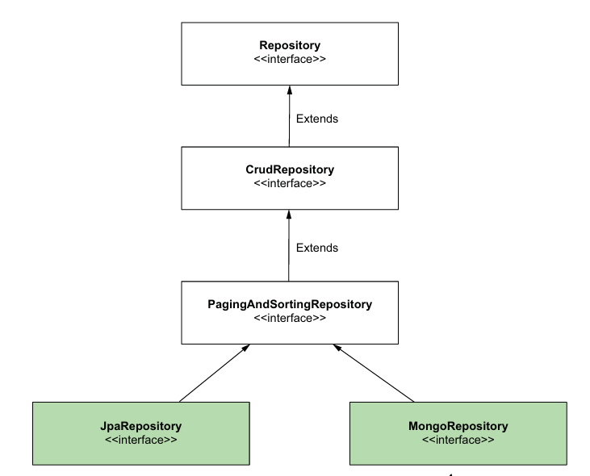

# Capítulo 14 - Spring Data
* O que é o Spring Data?
* Usando Spring Data JBDC
* Usando ```@Query```

## O que é Spring Data?
O **Spring Data** é um submódulo do ecossistema Spring que tem o propósito de simplificar a camada de persistência eliminando grande parte do código boilerplate necessário para interação com bancos de dados.

Ele faz isso oferecendo um conjunto de interfaces e abstrações comuns que podem ser aplicadas a diferentes tecnologias de persistência (JDBC, JPA, MongoDB, Redis, etc).

Vale salientar que, precisamos incluir dependências separadas para cada tecnologia com a qual queremos integrar o sistema. Por ex: "spring-boot-starter-data-jdbc" para JDBC; "spring-boot-starter-data-jpa" para JPA; e assim por diante.

### Como funciona?
O Spring Data gira em torno de interfaces genéricas que definem contratos para operações de persistência. Aos estendê-las, não precisamos implementar nada manualmente, o próprio framework gera as implementações em tempo de execução. Entre as principais estão:

* **Repository**: interface de marcação, não herda nenhum método de persistência, apenas identifica a classe como um repositório Spring Data.

* **CrudRepository**: define o contrato mais simples: operações de leitura, atualização e exclusão (CRUD).

* **PagingAndSortingRepository**: estende ```CrudRepository``` e adiciona operações relacionadas a ordenamento e paginação.


## Usando o Spring Data JDBC
Partindo para a prática, vamos replicar o exemplo do capítulo passado, onde temos o objetivo de simular uma transferência bancária. 

Para executar algumas de suas funcionalidades, o Spring Data precisa saber que campo do nosso modelo de dados é mapeado para a chave primária, pra isso o anotamos com a anotação ```@Id```. Por ex:

```java
public class Account {
    @Id
    private UUID id;

    private String name;
    private BigDecimal amount;
}

// getters e setters
```

A partir daqui podemos criar o nosso repositório. No caso só precisamos de operações CRUD nesse exemplo, então estenderemos a interface ```CrudRepository```. Para todo tipo de interface do Spring Data, precisamos fornecer os seguintes tipos:

* O tipo da entidade que será manipulada (```Account```). 
* O tipo da chave primária (```UUID```).

```java
public interface AccountRepository 
extends CrudRepository<Account, UUID> {}
```

Com isso, já somos capazes de executar operações CRUD. Ainda assim, a interface não provê todas as operações que poderiamos realizar a partir de queries SQL. Para isso, o Spring Data possui a funcionalidade de **Query Methods**, que nos permite criar consultas apenas definindo o nome do método dentro do repositório:

``` java
public interface AccountRepository 
        extends CrudRepository<Account, UUID> {

    List<Account> findAccountsByName(String name);
}
```

A definição de nomes segue um padrão bem definido, no exemplo acima:

* O prefixo (nesse caso "find") indica que queremos executar um *SELECT*.

* O próximo termo (nesse caso "accounts") identifica a entidade alvo da consulta.

* O sufixo "by" espera por uma condição de filtro, traduzida em "WHERE name = ?".

* O parâmetro ```String name``` será o valor utilizado na cláusula WHERE.

Apesar da simplicidade dessa abordagem, esse recurso ainda possui algumas limitações importantes como:

* **Complexidade no nome do método**: consultas mais complexas podem resultar em nomes muito longos, prejudicando a legibilidade.

* **Risco em refatorações**: renomeações descuidadas podem alterar o comportamento da aplicação acidentalmente.

## Usando @Query

Um recurso simples pra contornar essas problemas é a anotação ```@Query```. Com ela definimos explicitamente a consulta que será executada, sem depender da tradução do nome do método. Por exemplo:

```java
public interface AccountRepository 
        extends CrudRepository<Account, UUID> {

    @Query("SELECT * FROM account WHERE name = :name") 
    List<Account> findByName(@Param("name") String name);
}
```

Nesse caso o nome do método ```findByName``` é usado apenas por convenção.

## Usando ```@Modifying```
Por padrão, quando anotamos um método de repositório com ```@Query```, o Spring Data entende que essa query é somente leitura — ou seja, um *SELECT*. Por conta disso, quando usamos **INSERT**, **UPDATE** ou **DELETE** temos problemas pois ele continua esperando uma lista de resultados ou um ```Optional```.

Nesse caso usamos a anotação ```@Modifying``` para informar o 
Spring Data que a consulta não retorna dados, mas modifica registros no banco. Exemplo:

```java
public interface AccountRepository extends CrudRepository<Account, UUID> {
    @Modifying
    @Query("UPDATE account SET amount = :amount WHERE id = :id")
    public void changeAmount(Long id, BigDecimal amount);
}
```